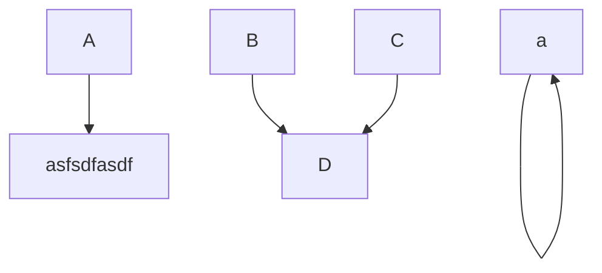

# [LorePlotter](https://alexaegis.github.io/loreplotter/)

      

## Planned Features

- **World map**\
   A 3D sphere that can be rotated and placed objects onto it like `Characters` and `Paths`. You can access a `characters` and `paths` context menu on the map, allowing for edits.\
   By dragging a `character` onto a different point on the map, you can plan a `route` on an existing `path` or appending a single `segment` to the end of one with a modifier key, if not the `character` will be snapped to an existing path.

- **Paths**\
   Single `paths` can be planned by dragging a character while holding the _shift_ key. This will automatically create a route to the point where you drop it.\
   Or you can use the dedicated `path tool` to select two point, between which a path will be created.\
   Paths can also be selected on the `World map` and edited by it's context menu. Where you can add a `weight` attribute. The higher the `weight` attribute the more likely a character will avoid it while planning a `route`.

- **Characters**\
   Being capable of creating multiple `character` entities that can store metadata like `knowledge` (Objects that are either created or can be passed onto another `character`), `position` (Longtitude and latitude, so the `character` can be shown on the `world map`)

- **Timeline**\
  A timeline panel on the bottom of the screen on which you can see all your `characters` as block from the point they are introduced to the point they are bid farewell.\
  On the timeline you can pan, scroll, zoom onto different timeframes, for better readability.\
  The timeline is infinite, the only loaded parts are the one you're seeing.\
  By panning the `cursor` on the timeline you can change the displayed context on the map, and ultimately see whats happening at that point of time on the map.

## Architecture

The software is built with the Angular framework and many other JavaScript modules and works as a [PWA](https://en.wikipedia.org/wiki/Progressive_web_applications). Persistence is achieved with a [service worker](https://developers.google.com/web/fundamentals/primers/service-workers/)'s local storage.

---

## Technologies

### [Angular 7](https://angular.io/)

> **Frontend** framework

### [Node 10](https://nodejs.org/en/)

> **JavaScript** runtime

### [NPM](https://www.npmjs.com/)

> **Package manager** for JS projects

### [Sass](https://sass-lang.com/)

> **CSS** extension

### [Three](https://threejs.org/)

> **WebGL** graphics

### [Tween](https://github.com/tweenjs/tween.js/)

> **Animation** easing

### [Akita](https://github.com/datorama/akita)

> **State** management

### (Not Yet Introduced) [Dragula](https://github.com/valor-software/ng2-dragula)

> **Drag and drop** made really easy

### (Not Yet Introduced) [Ag-Grid](https://www.ag-grid.com)

> **Datatable**, the best

### (Not Yet Introduced) [FontAwesome](https://fontawesome.com/)

> **Icons**, awesome ones

## Recommendations

### [Visual Studio Code](https://code.visualstudio.com/)

> **IDE** for mainly the frontend but can be used for both. [Settings](./.vscode/)

### [Fira Code](https://github.com/tonsky/FiraCode)

> **Font** with ligatures

### [LiveReload](https://chrome.google.com/webstore/detail/livereload/jnihajbhpnppcggbcgedagnkighmdlei)

> **Reload the Page** for Chrome when the server changes

## Services

### [GitHub](https://github.com/)

> **Git** repository

### [GitHub Pages](https://pages.github.com/)

> **Static** hosting

### [Travis](https://travis-ci.com/)

> **Continuous Integration** solution

### [Heroku](https://heroku.com/)

> **Deployment Platform**

### [Codacy](https://app.codacy.com/)

> **Code review** tool

### [Code Climate](https://codeclimate.com/dashboard)

> **Code review** tool for maintainability and coverage

### [Snyk](https://snyk.io/)

> **Vulnerability** detection

### [Libraries.io](https://libraries.io/)

> **Dependency** watcher

### [Shields.io](https://shields.io/#/)

> **Badges** to look cool
